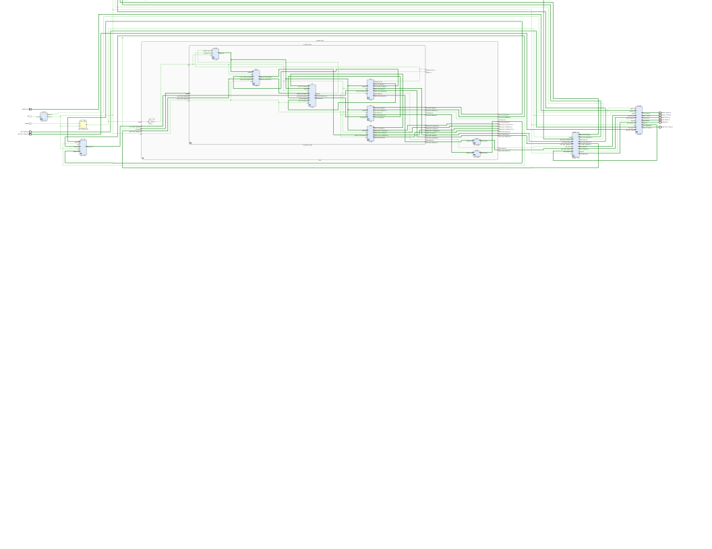
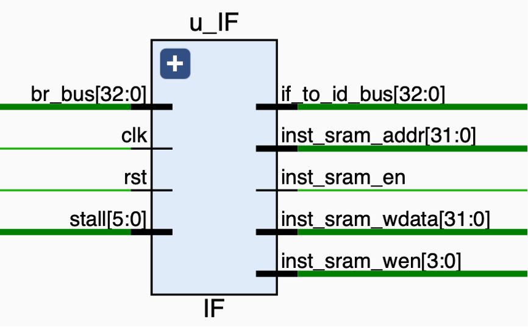
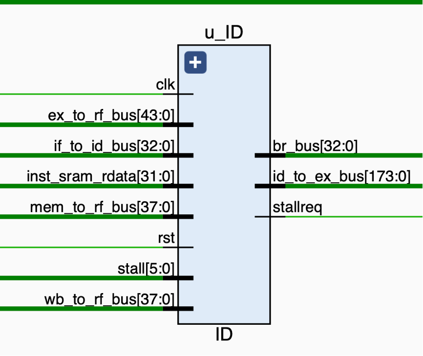
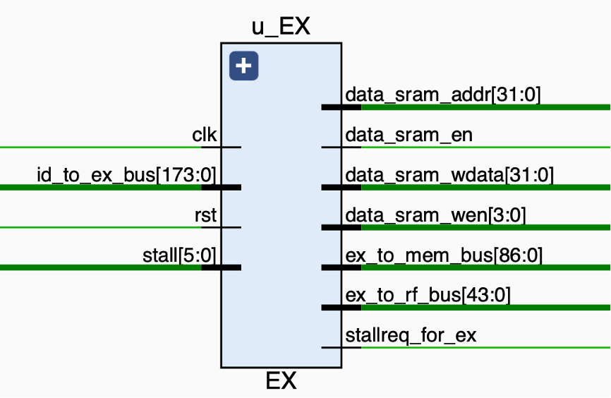
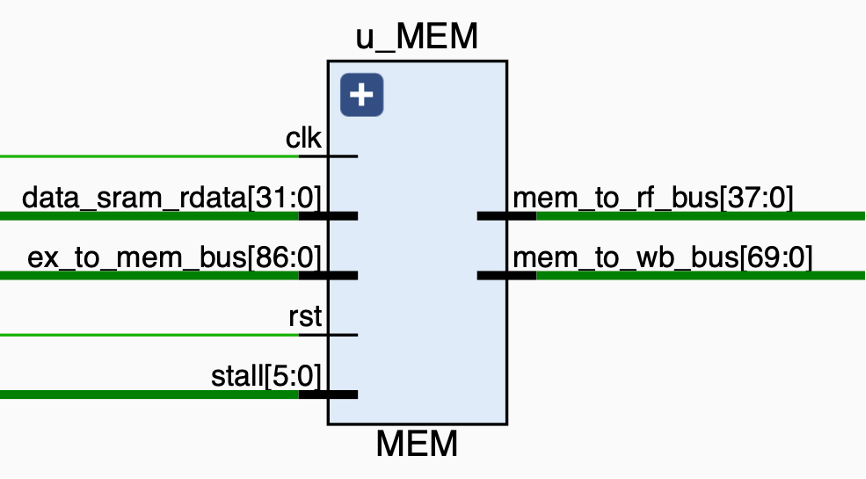
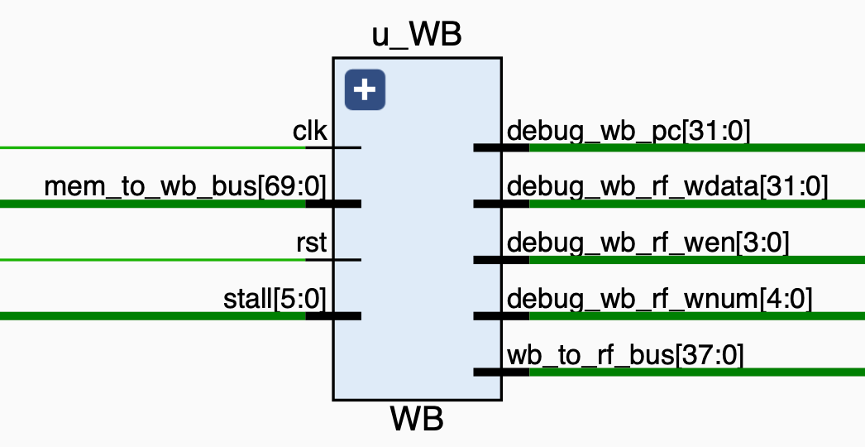
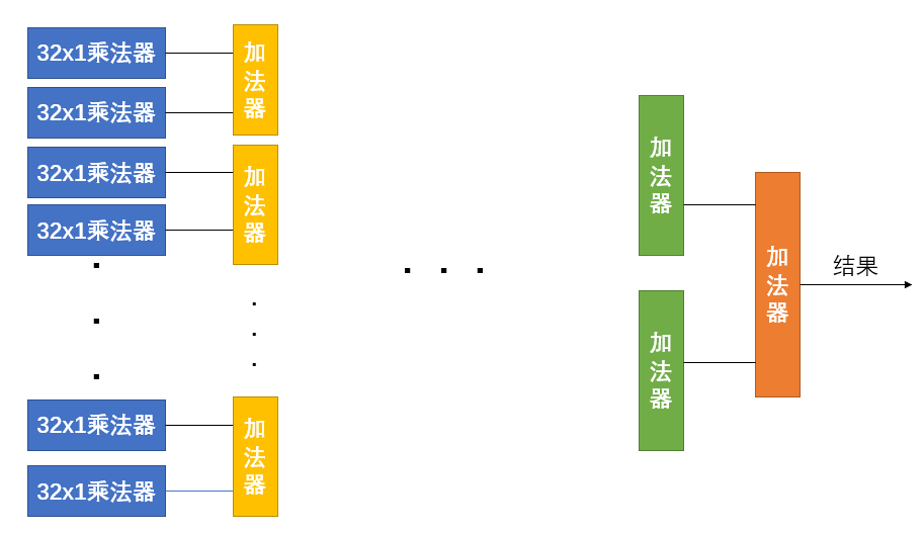

# CPU设计与实现实验
[toc]
## 实验参与人员：
*siri-2001* 程思睿

*执夜未曦* 马韬洵

*vvelfii*  孙辉

## 实验连线图：

## 实验总览
### 总共完成了 52 条指令
#### 算数运算指令 14 条 
##### ADD
**Format**: ADD rd, rs, rt 

**Purpose**: Add Word

To add 32-bit integers. If an overflow occurs, then trap.

**Description**: GPR[rd] <- GPR[rs] + GPR[rt]
##### ADDI
**Format**: ADDI rt, rs, immediate 

**Purpose**: Add Immediate Word

To add a constant to a 32-bit integer. If overflow occurs, then trap.

**Description**: GPR[rt] <- GPR[rs] + immediate
##### ADDU
**Format**: ADDU rd, rs, rt

**Purpose**: Add Unsigned Word

To add 32-bit integers.

**Description**: GPR[rd] <- GPR[rs] + GPR[rt]
##### ADDIU
**Format**: ADDIU rt, rs, immediate 

**Purpose**: Add Immediate Unsigned Word

To add a constant to a 32-bit integer.

**Description**: GPR[rt] <- GPR[rs] + immediate
##### SUB
**Format**: SUB rd, rs, rt 

**Purpose**: Subtract Word

To subtract 32-bit integers. If overflow occurs, then trap.

**Description**: GPR[rd] <- GPR[rs] - GPR[rt]
##### SUBU
**Format**: SUBU rd, rs, rt 

**Purpose**: Subtract Unsigned Word

To subtract 32-bit integers.

**Description**: GPR[rd] <- GPR[rs] - GPR[rt]
##### SLT
**Format**: SLT rd, rs, rt

**Purpose**: Set on Less Than

To record the result of a less-than comparison.

**Description**: GPR[rd] <- (GPR[rs] < GPR[rt])
##### SLTI
**Format**: SLTI rt, rs, immediate 

**Purpose**: Set on Less Than Immediate

To record the result of a less-than comparison with a constant.

**Description**: GPR[rt] <- (GPR[rs] < sign_extend(immediate) )
##### SLTU
**Format**: SLTU rd, rs, rt

**Purpose**: Set on Less Than Unsigned

To record the result of an unsigned less-than comparison.

**Description**: GPR[rd] <- (GPR[rs] < GPR[rt])
##### SLTIU
**Format**: SLTIU rt, rs, immediate

**Purpose**: Set on Less Than Immediate Unsigned

To record the result of an unsigned less-than comparison with a constant.

**Description**: GPR[rt] <- (GPR[rs] < sign_extend(immediate))
##### DIV
**Format**: DIV rs, rt

**Purpose**: Divide Word

To divide a 32-bit signed integers.

**Description**: (HI, LO) <- GPR[rs] / GPR[rt]
##### DIVU
**Format**: DIVU rs, rt

**Purpose**: Divide Unsigned Word

To divide 32-bit unsigned integers

**Description**: (HI, LO) <- GPR[rs] / GPR[rt]
##### MULT
**Format**: MULT rs, rt 

**Purpose**: Multiply Word

To multiply 32-bit signed integers.

**Description**: (HI, LO) <- GPR[rs] x GPR[rt]
##### MULTU
**Format**: MULTU rs, rt 

**Purpose**: Multiply Unsigned Word

To multiply 32-bit unsigned integers.

**Description**: (HI, LO) <- GPR[rs] x GPR[rt]
#### 逻辑运算指令 8 条 
##### AND
**Format**: AND rd, rs, rt 

**Purpose**: and

To do a bitwise logical AND.

**Description**: GPR[rd] <- GPR[rs] and GPR[rt]
##### ANDI
**Format**: ANDI rt, rs, immediate 

**Purpose**: and immediate

To do a bitwise logical AND with a constant

**Description**: GPR[rt] <- GPR[rs] and zero_extend(immediate)
##### LUI
**Format**: LUI rt, immediate 

**Purpose**: Load Upper Immediate

To load a constant into the upper half of a word

**Description**: GPR[rt] <- sign_extend(immediate || 016)
##### NOR
**Format**: NOR rd, rs, rt

**Purpose**: Not Or

To do a bitwise logical NOT OR.

**Description**: GPR[rd] <- GPR[rs] nor GPR[rt]
##### OR
**Format**: OR rd, rs, rt

**Purpose**: Or

To do a bitwise logical OR.

**Description**: GPR[rd] <- GPR[rs] or GPR[rt]
##### ORI
**Format**: ORI rt, rs, immediate 

**Purpose**: Or Immediate

To do a bitwise logical OR with a constant.

**Description**: GPR[rt] <- GPR[rs] or immediate
##### XOR
**Format**: XOR rd, rs, rt 

**Purpose**: Exclusive OR

To do a bitwise logical Exclusive OR.

**Description**: GPR[rd] <- GPR[rs] XOR GPR[rt]
##### XORI
**Format**: XORI rt, rs, immediate 

**Purpose**: Exclusive OR Immediate

To do a bitwise logical Exclusive OR with a constant.

**Description**: GPR[rt] <- GPR[rs] XOR immediate
#### 移位指令 6 条
##### SLLV
**Format**: SLLV rd, rt, rs

**Purpose**: Shift Word Left Logical Variable

To left-shift a word by a variable number of bits.

**Description**: GPR[rd] <- GPR[rt] << GPR[rs]
##### SLL
**Format**: SLL rd, rt, sa 

**Purpose**: Shift Word Left Logical

To left-shift a word by a fixed number of bits.

**Description**: GPR[rd] <- GPR[rt] << sa
##### SRAV
**Format**: SRAV rd, rt, rs

**Purpose**: Shift Word Right Arithmetic Variable

To execute an arithmetic right-shift of a word by a variable number of bits.

**Description**: GPR[rd] <- GPR[rt] >> GPR[rs] (arithmetic)
##### SRA
**Format**: SRA rd, rt, sa

**Purpose**: Shift Word Right Arithmetic

To execute an arithmetic right-shift of a word by a fixed number of bits.

**Description**: GPR[rd] <- GPR[rt] >> sa (arithmetic)
##### SRLV
**Format**: SRLV rd, rt, rs

**Purpose**: Shift Word Right Logical Variable

To execute a logical right-shift of a word by a variable number of bits.

**Description**: GPR[rd] <- GPR[rt] >> GPR[rs] (logical)
##### SRL
**Format**: SRL rd, rt, sa

**Purpose**: Shift Word Right Logical

To execute a logical right-shift of a word by a fixed number of bits.

**Description**: GPR[rd] <- GPR[rt] >> sa (logical)
#### 分支跳转指令 12 条 
##### BEQ
**Format**: BEQ rs, rt, offset 

**Purpose**: Branch on Equal

To compare GPRs then do a PC-relative conditional branch.

**Description**: if GPR[rs] = GPR[rt] then branch
##### BNE
**Format**: BNE rs, rt, offset

**Purpose**: Branch on Not Equal

To compare GPRs then do a PC-relative conditional branch

**Description**: if GPR[rs] != GPR[rt] then branch
##### BGEZ
**Format**: BGEZ rs, offset 

**Purpose**: Branch on Greater Than or Equal to Zero

To test a GPR then do a PC-relative conditional branch

**Description**: if GPR[rs] >= 0 then branch
##### BGTZ
**Format**: BGTZ rs, offset 

**Purpose**: Branch on Greater Than Zero 

To test a GPR then do a PC-relative conditional branch.

**Description**: if GPR[rs] > 0 then branch
##### BLEZ
**Format**: BLEZ rs, offset 

**Purpose**: Branch on Less Than or Equal to Zero

To test a GPR then do a PC-relative conditional branch.

**Description**: if GPR[rs] <= 0 then branch
##### BLTZ
**Format**: BLTZ rs, offset

**Purpose**: Branch on Less Than Zero

To test a GPR then do a PC-relative conditional branch.

**Description**: if GPR[rs] < 0 then branch
##### BGEZAL
**Format**: BGEZAL rs, offset

**Purpose**: Branch on Greater Than or Equal to Zero and Link

To test a GPR then do a PC-relative conditional procedure call

**Description**: if GPR[rs] >= 0 then procedure_call
##### BLTZAL
**Format**: BLTZAL rs, offset

**Purpose**: Branch on Less Than Zero and Link

To test a GPR then do a PC-relative conditional procedure call.

**Description**: if GPR[rs] < 0 then procedure_call
##### J
**Format**: J target 

**Purpose**: Jump

To branch within the current 256 MB-aligned region.
##### JAL
**Format**: JAL

**target Purpose**: Jump and Link

To execute a procedure call within the current 256MB-aligned region.
##### JR
**Format**: JR rs 

**Purpose**: Jump Register

To execute a branch to an instruction address in a register

**Description**: PC <- GPR[rs]
##### JALR
**Format**: JALR rs (rd = 31 implied) 

JALR rd, rs 

**Purpose**: Jump and Link Register

To execute a procedure call to an instruction address in a register

**Description**: GPR[rd] <- return_addr, PC <- GPR[rs]
#### 数据移动指令 4 条
##### MFHI
**Format**: MFHI rd

**Purpose**: Move From HI Register

To copy the special purpose HI register to a GPR. 

**Description**: GPR[rd] <- HI
##### MFLO
**Format**: MFLO rd

**Purpose**: Move From LO Register

To copy the special purpose LO register to a GPR. 

**Description**: GPR[rd] <- LO
##### MTHI
**Format**: MTHI rs 

**Purpose**: Move to HI Register

To copy a GPR to the special purpose HI register. 

**Description**: HI <- GPR[rs]
##### MTLO
**Format**: MTLO rs

**Purpose**: Move to LO Register

To copy a GPR to the special purpose LO register. 

**Description**: LO <- GPR[rs]
#### 访存指令 8 条 
##### LB
**Format**: LB rt, offset(base) 

**Purpose**: Load Byte

To load a byte from memory as a signed value.

**Description**: GPR[rt] <- memory[GPR[base] + offset]
##### LBU
**Format**: LBU rt, offset(base) 

**Purpose**: Load Byte Unsigned

To load a byte from memory as an unsigned value

**Description**: GPR[rt] <- memory[GPR[base] + offset]
##### LH
**Format**: LH rt, offset(base) 

**Purpose**: Load Halfword

To load a halfword from memory as a signed value

**Description**: GPR[rt] <- memory[GPR[base] + offset]
##### LHU
**Format**: LHU rt, offset(base) 

**Purpose**: Load Halfword Unsigned

To load a halfword from memory as an unsigned value

**Description**: GPR[rt] <- memory[GPR[base] + offset]
##### LW
**Format**: LW rt, offset(base) 

**Purpose**: Load Word

To load a word from memory as a signed value

**Description**: GPR[rt] <- memory[GPR[base] + offset]
##### SB
**Format**: SB rt, offset(base)

**Purpose**: Store Byte

To store a byte to memory.

**Description**: memory[GPR[base]  offset] <- GPR[rt]
##### SH
**Format**: SH rt, offset(base) 

**Purpose**: Store Halfword

To store a halfword to memory.

**Description**: memory[GPR[base] + offset] <- GPR[rt]
##### SW
**Format**: SW rt, offset(base) 

**Purpose**: Store Word

To store a word to memory.

**Description**: memory[GPR[base] + offset] <- GPR[rt]
## 单个流水段说明
### IF
#### 整体功能说明
IF段负责取指，将得到的指令传递给ID段进行后续操作。
#### 结构示意图

### ID
#### 整体功能说明
ID段负责译码，将IF段传来的指令进行拆分解析。
#### 结构示意图

### EX
#### 整体功能说明
EX段负责执行，EX段对经ID段解析的指令进行运算，得到相关的结果
#### 结构示意图

### MEM
#### 整体功能说明
在MEM段进行对内存数据的读入，通过判断，决定使用的数据是从内存中传入的还是从EX段传入的，并将其传到WB段
#### 结构示意图

### WB
####整体功能说明
WB段负责将数据写回，
#### 结构示意图

###MUL
#### 加法树乘法器
##### 基本思想：
加法树的思想在于用加法器每两个元素加在一起，其最大的特点在于用资源的增加而提高运行速度，逻辑关系简单明了。
它结合了查找表和移位相加的有点，速度比较快。
##### 图示：

#### 移位相加乘法器
##### 基本思想：
移位相加乘法器的计算流程为从被乘数的左边（最低位）开始，如果第 i 位为 1，则乘数左移 i （i = 0,1,2,……，size -1）位之后与之前的值相加，若最低位为 0 ，则保持不变，直至被乘数的最高位。耗用资源相对少，运算速度比较慢。

##参考资料
1. 《自己动手做cpu_雷思磊》
2. [《A03_“系统能力培养大赛”MIPS指令系统规范_v1.01》](doc/A03_“系统能力培养大赛”MIPS指令系统规范_v1.01.pdf)
3. [《A06_vivado安装说明_v1.00》](doc/A06_vivado安装说明_v1.00.pdf)
4. [《A07_vivado使用说明_v1.00》](doc/A07_vivado使用说明_v1.00.pdf) 
5. [《A08_交叉编译工具链安装_v1.00》](doc/A08_交叉编译工具链安装_v1.00.pdf)
6. [《A09_CPU仿真调试说明_v1.00》](doc/A09_CPU仿真调试说明_v1.00.pdf)
7. [_MIPS_Architecture_MIPS64_InstructionSet_](doc/MIPS_Architecture_MIPS64_InstructionSet_%20AFP_P_MD00087_06.05%20(1).pdf)

